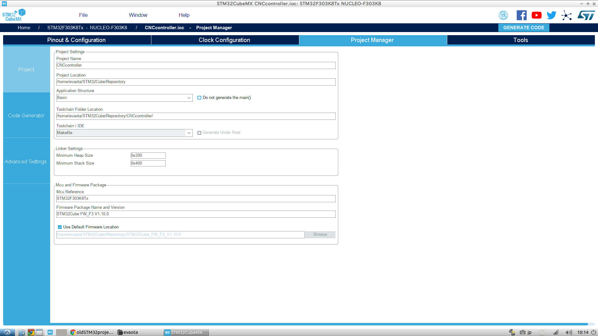
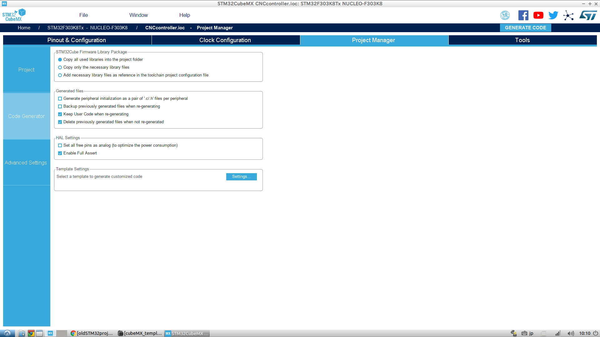

# STM32FcubeMX Template Project

- ## Abstract
    STM32cubeMXでプロジェクトの生成から、使用について

- ## How to generate project
    *using STM32cubeMX version is v5.0.0*

    
    1. ### プロジェクトネームとファルダを指定
    2. ### GNU-GCCでコンパイルするためToolchainをMakefileに指定する。
    

    3. ### 上の画像のように設定する。
    4. 右上のGENERATE CODEでプロジェクトを生成

- ## Compile
    生成したプロジェクトに移動して以下のコマンドを実行する
    | コマンド | 内容 |
    |:---------:|:------------------------------------------------------|
    | make | すべてのソースファイルがコンパイルされ,buildフォルダに実行ファイルが生成されます。 |
    | make clean | buildフォルダが消去され、実行ファイル、オブジェクトファイルが消去されます。 |
    | make -j | コンパイル時CPUが並列で処理します。他のオプションと兼用可能 |
    | make -B | すべてのファイルが強制的に再コンパイルされます。 |
    | make OPT=-Ox | 最適化オプションを変更します。xの値で最適化レベルを変更できます。デフォルトは-Og |

- ## 新規プロジェクトの作成
    1. github上に新しいリポジトリを作成   
    2. githubから以下のコマンドでリポジトリをPC内にクローンする   
        > ~/$ **git clone https://github.com/wakabayashiryo/cubeMX_template.git**   
    3. STM32cubeMXでプロジェクトの生成   
    4. 生成したプロジェクトをこのリポジトリに移動   
    5. １で作成したリポジトリアドレスを追加   
        > ~/Hoge_Project$ **git remote add hoge https://github.com/yourid/repository.git**   
    6. １で作成したリポジトリにプッシュする   
        > ~/Hoge_Project$ **git push hoge master**   

        **\*Worning** 新しく作成したリポジトリから　***origin***　にプッシュしないでください    

    ### *最新のテンプレートにアップデート
    - 以下のコマンドをプロジェクトフォルダー内で実行してください
        > git pull origin master

- ## 書き込み　デバッグ
    STlinkを使用して書き込み

- ## NUCLEO使用時の注意
    NUCLEOのST-LINKから出力されるMCO(MasterClockOutput)をメインクロックで使用する場合、必ず回路図を確認してMCOとクロック入力ピンを接続してください。   
    ※デフォルトでは接続されていない。ショート用パッドにハンダ付けして接続する

- ## STlinkのインストール   
    *Install ***cmake*** and ***libudev1.0.0-dev*** before install stlink*
    1. Download st-link_master for github https://github.com/texane/stlink.git
    2. read README.md

    - Installed sequence when Octorber 8 2018   
        1. confirm necessary packages [CMake (minimal v2.8.7) C compiler (gcc, clang, mingw)Libusb 1.0  (minimal v1.0.9)]
            > sudo apt-get install cmake gcc clang mingw libusb-1.0-0
        2. make release and debug in stlink directory
            > sudo  make release   
            > sudo make debug
        3. install   
        You could install to a user folder e.g $HOME:   
            >  cd build/Release; make install DESTDIR=$HOME   
        
            or system wide
        
            > cd build/Release; sudo make install   
    * When st-util execute,If displayed below message
        > st-util: error while loading shared libraries: libstlink.so.1: cannot open shared object file: No such file or directory   
    
        can Fixing cannot open shared object file   
        > sudo ldconfing

    * When st-util execute,Cmake error occured *****error message>>** (error while loading shared libraries: libstlink-shared.so.1:)***   
    Type command below commands!!   
    > make install DESTDIR=_install   
    > export LD_LIBRARY_PATH=$PWD/_install/usr/local/lib   
    > ldd _install/usr/local/bin/st-info

- ## 備考
    - コンパイル時に以下のエラーが発生したとき   
        > /usr/lib/gcc/arm-none-eabi/6.3.1/../../../arm-none-eabi/bin/ld: error: /usr/lib/gcc/arm-none-eabi/6.3.1/../../../arm-none-eabi/lib/crt0.o: Conflicting CPU architectures 13/1   
        > /usr/lib/gcc/arm-none-eabi/6.3.1/../../../arm-none-eabi/bin/ld: failed to merge target specific data of file /usr/lib/gcc/arm-none-eabi/6.3.1/../../../arm-none-eabi/lib/crt0.o

        https://github.com/bbcmicrobit/micropython/issues/514   
        以上のページに対象法あり

        https://packages.ubuntu.com/cosmic/all/libnewlib-dev/download   
        https://packages.ubuntu.com/cosmic/all/libnewlib-arm-none-eabi/download   
        以上のページより、パッケージをダウンロードして以下のコマンドでインストール   
        > sudo dpkg -i libnewlib-arm-none-eabi_3.0.0.20180802-2_all.deb libnewlib-dev_3.0.0.20180802-2_all.deb

 
 - ### Version
    |version|data|contents |
    |:-----:|:-------:|:----------------:|
    |ver0.1|2018/12/26|add README.md|
 
 - # License Information
    ## This software is released under the MIT License, see LICENSE